## Project Description
The Danish Business Insights Platform is a web application designed to provide comprehensive financial analysis and insights into the Danish business sector. It caters to investors looking to make informed decisions by exploring financial trends, sector comparisons, and company-specific analyses.

## Installation and Setup
To run this application locally:

1. Clone the repository to your local machine.

2. Ensure you have Python installed and set up a virtual environment.

3. Install the required dependencies:
```bash
pip install -r requirements.txt
```

4. Run the application using Streamlit:
```bash
streamlit run main.py
```
## Features and Functionalities
- **Financial Trends Analysis 📊:** Explore the financial dynamics of selected sectors, tracking key metrics like average profit/loss and equity.
  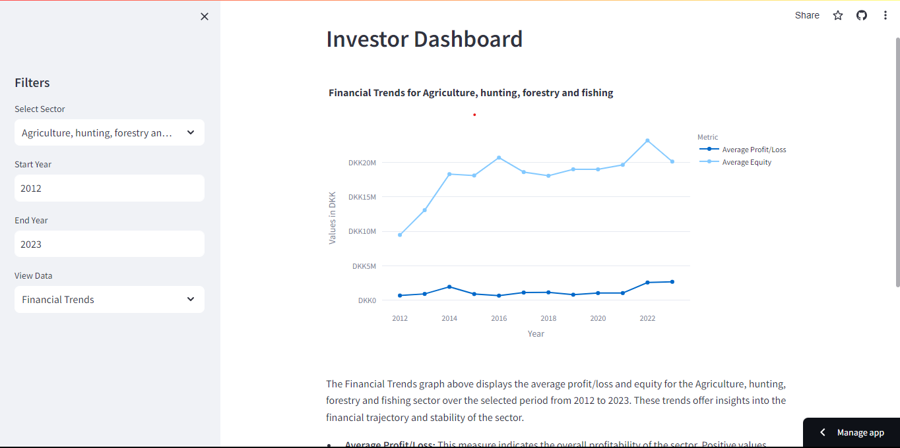
  
- **Financial Health Indicators 💪**: Analyze key financial ratios and metrics like Return on Assets and Solvency Ratio to gauge the health of sectors.
  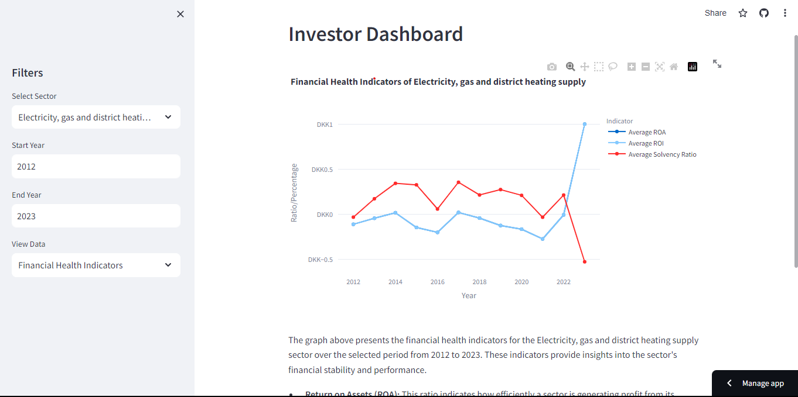
  
- **Sector Comparison ⚖️**: Compare financial performance metrics of selected companies against sector averages.
  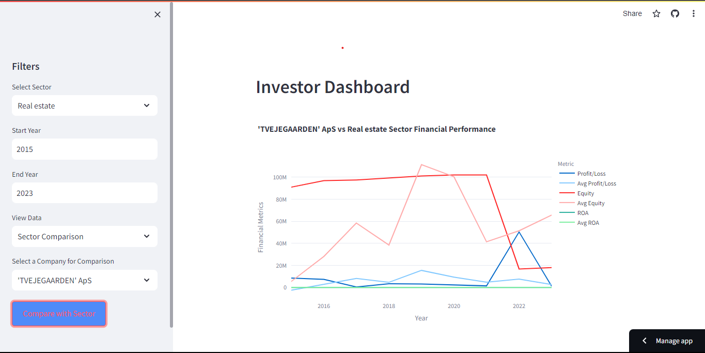
  
- **Company Analysis 🔍**: Conduct deep dives into the financial history and performance of individual companies.
- 
  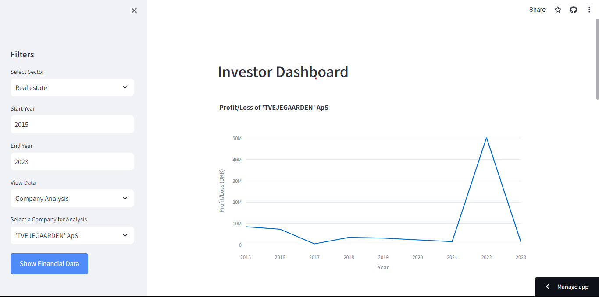
  
  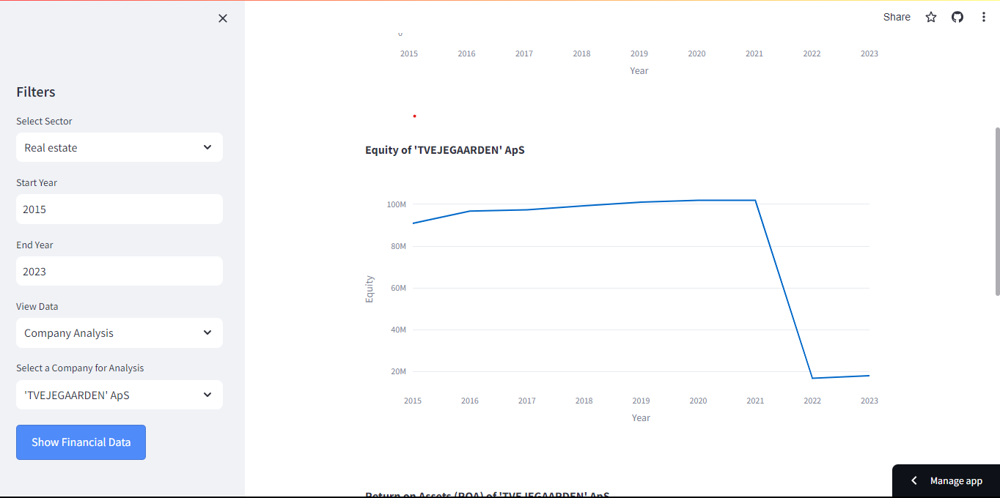
  
  ")
  
**Multi-Company Comparison 🤝:** Conduct comparative analyses of multiple companies within a sector, unveiling the strongest investment prospects based on comprehensive financial data.
  
  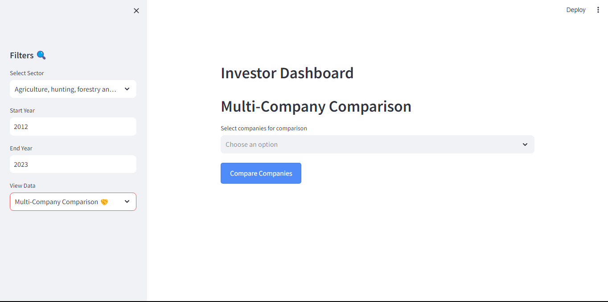
  
  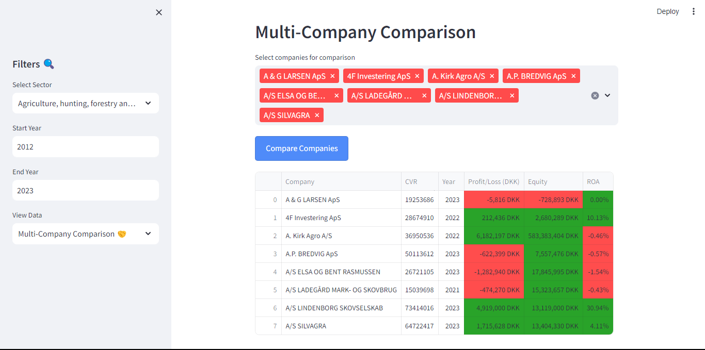
  
  ")

- **Company Information 🛈**: Provides detailed insights into a specific company, including its sector, contact details, financial health, and operational purpose, aiding investors in making informed decisions about their investments.
  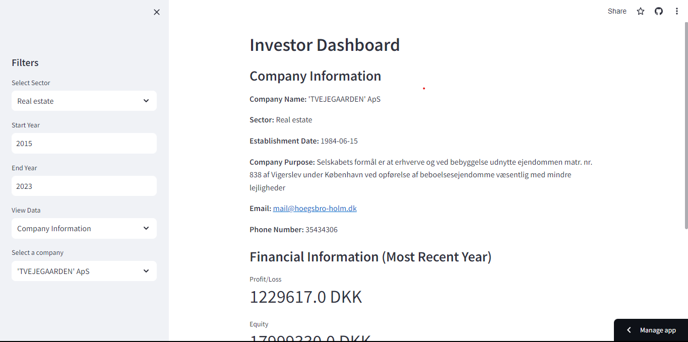
  
- **Hidden Gems 💎:** Uncover undervalued companies with strong financial health but recent profit dips, presenting potential rebound opportunities.
  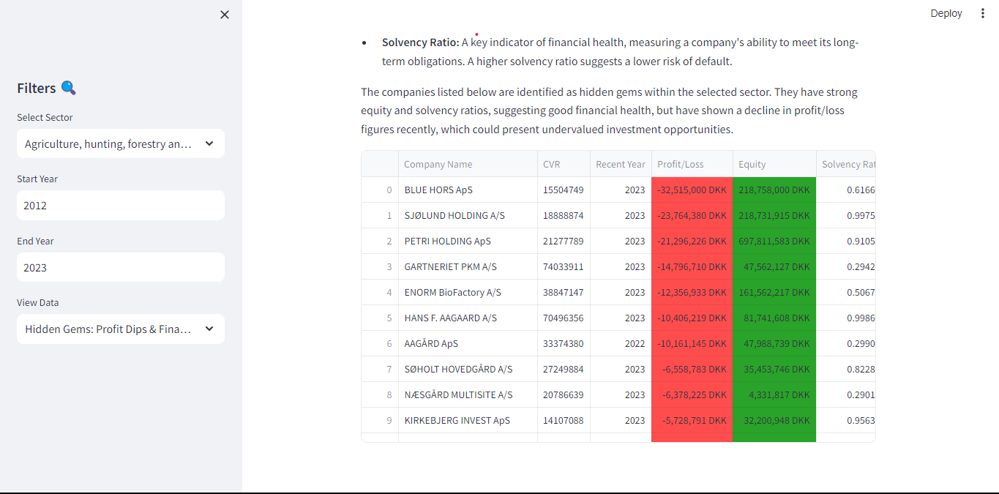

 
## Technologies Used
- Python
- Streamlit
- Plotly for data visualization
- SQLite for database management
- Pandas for data analysis and manipulation

## How to Use the App
Follow this step-by-step guide to navigate through the Danish Business Insights Platform:

1. **Accessing the Platform**:
- Click on the link to open the web application: [Danish Business Insights Platform](https://danish-business-insights.streamlit.app/).
- You will land on the homepage of the platform, which provides an overview of the features and the value it offers to investors.

2. **Landing Page**:
- The landing page introduces the Danish Business Insights Platform with a brief description and visual elements that highlight the key functionalities.
- Explore the features listed or proceed by clicking the “Get Started” button.
  
  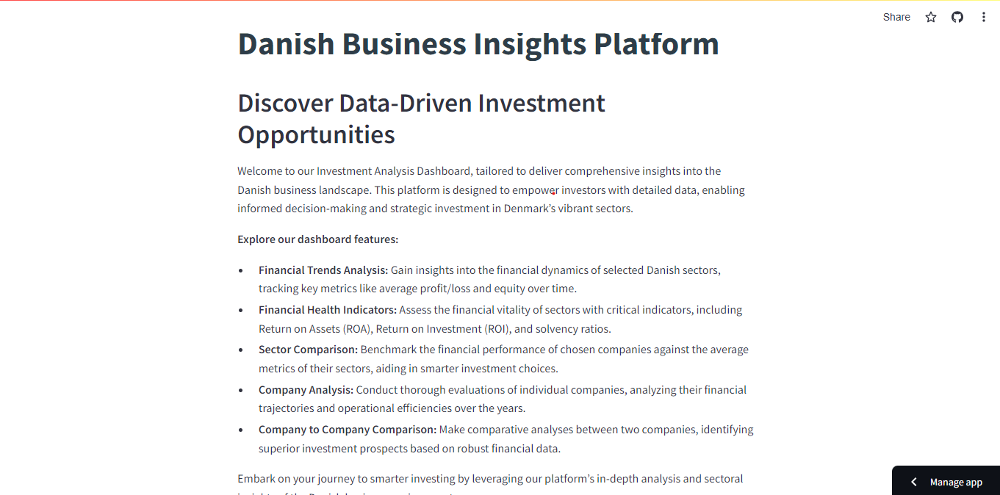

3. **User Authentication**:
- Upon clicking “Get Started”, you will be directed to the login page.
- Existing users can log in with their credentials, while new users can register by providing a username, and password, and selecting sectors of interest.
  
  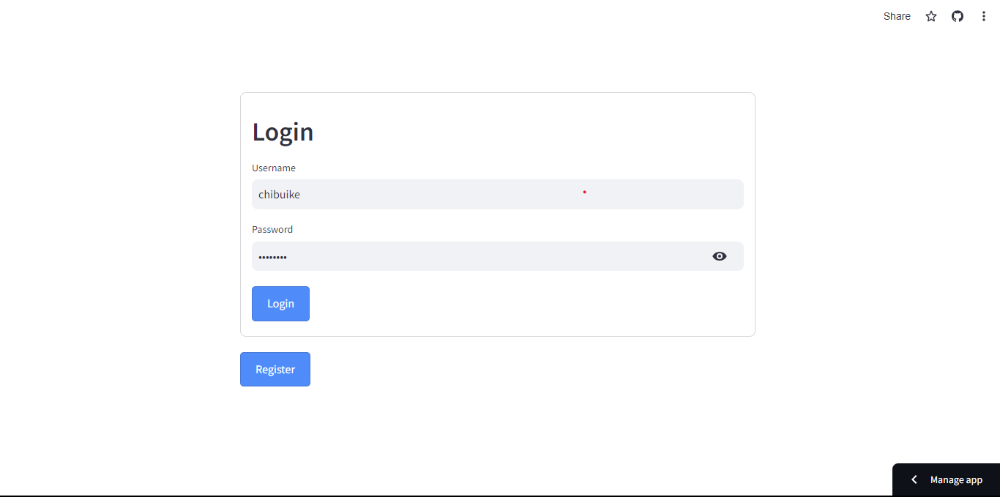

4. **Dashboard Navigation**:
- After logging in, you will access the dashboard, the central hub of analysis and data visualization.
- The sidebar on the dashboard allows you to select different sectors and data views.

  

5. **Interactive Data Views**:
- Select various options like Financial Trends, Company Analysis, etc., to view detailed analytical data and graphs.

6. **Detailed Analytics**:
- For each selection, detailed charts, graphs, and tables are presented, offering in-depth insights into the financial metrics and trends.

## Contribution Guidelines
If you would like to contribute to the project, please fork the repository, make your changes, and submit a pull request for review.

## Credits and Acknowledgments
This project was developed by me Chibuike Victor Akujuobi. Special thanks to everyone who contributed to the development and testing of this platform. Big thanks to my supervisor Mr Niels Eriksen for introducing the "skateboard, bike, car" approach, which significantly guided the development process of this platform.
